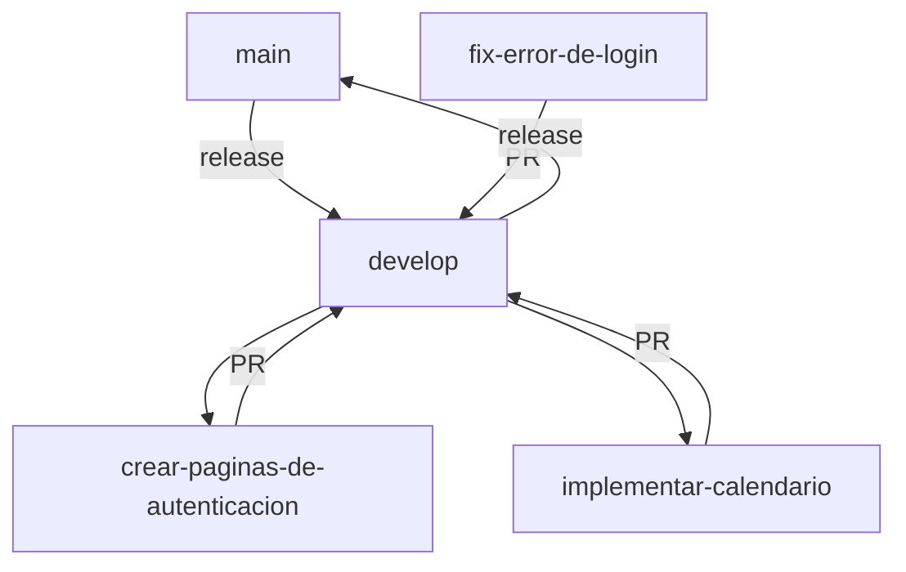

# 🧭 Guía de Ramas y Pull Requests – Git Flow para HealthTech

## 📌 Estructura de Ramas

```bash
main        → Rama de producción (versión estable y funcional)
develop     → Rama de integración para features
<nombre-de-la-issue> → Rama específica por cada issue
````

> ⚠️ **Importante:** Las ramas se crean **directamente desde los issues**, utilizando su nombre como base en formato `kebab-case`.

## 🧱 Flujo de Trabajo

### 1. Clonar el repositorio

```bash
git clone <url-del-repo>
cd g20-HealthTech
```

### 2. Actualizar develop

```bash
git checkout develop
git pull origin develop
```

### 3. Crear una rama desde un issue

Ejemplo:

```bash
git checkout -b crear-paginas-de-autenticacion
```

### 4. Hacer commits significativos

```bash
git add .
git commit -m "feat: implementar formulario de login para paciente"
```

📋 Convenciones:

* `feat:` nueva funcionalidad
* `fix:` corrección de bug
* `docs:` documentación
* `style:` cambios de estilo
* `refactor:` cambios internos sin romper funcionalidad
* `test:` tests
* `chore:` tareas auxiliares

### 5. Mantener tu rama actualizada con develop

Antes del PR, hacé merge de `develop` en tu rama para prevenir conflictos:

```bash
git checkout develop
git pull origin develop
git checkout <tu-rama>
git merge develop
```

### 6. Subir la rama y crear Pull Request

```bash
git push origin <tu-rama>
```

Luego, en GitHub:

* Crear un **Pull Request hacia `develop`**
* Incluir:

  * Descripción de cambios
  * `Closes #XX` para vincular el issue
  * Instrucciones para testeo
  * Screenshots si aplica

### 7. Revisión y Merge

* Esperar al menos una revisión del equipo
* Resolver observaciones si hay
* Una vez aprobado, merge a `develop`
* No merges directamente a `main`

### 8. Eliminar la rama

```bash
git branch -d <tu-rama>
git push origin --delete <tu-rama>
```

## 🛠️ Bugs y Correcciones

* Siempre crear un issue antes de trabajar en un bug
* Crear una rama con el nombre del issue
* Seguir el mismo flujo de trabajo que una feature

## ✅ Checklist de Pull Request

Antes de crear el PR:

* [x] Código funcional
* [x] Rama actualizada con develop
* [x] Sin conflictos
* [x] PR bien documentado
* [x] Issue vinculado

## 🧭 Diagrama de Flujo



## 📚 Ejemplo de Flujo

**Issue:** `#13 - Implementar componente calendario interactivo`
**Rama:** `implementar-componente-calendario-interactivo`
**Commit:** `feat: agregar slots de citas al calendario`
**PR:** Pull Request a `develop`, con `Closes #13`

```